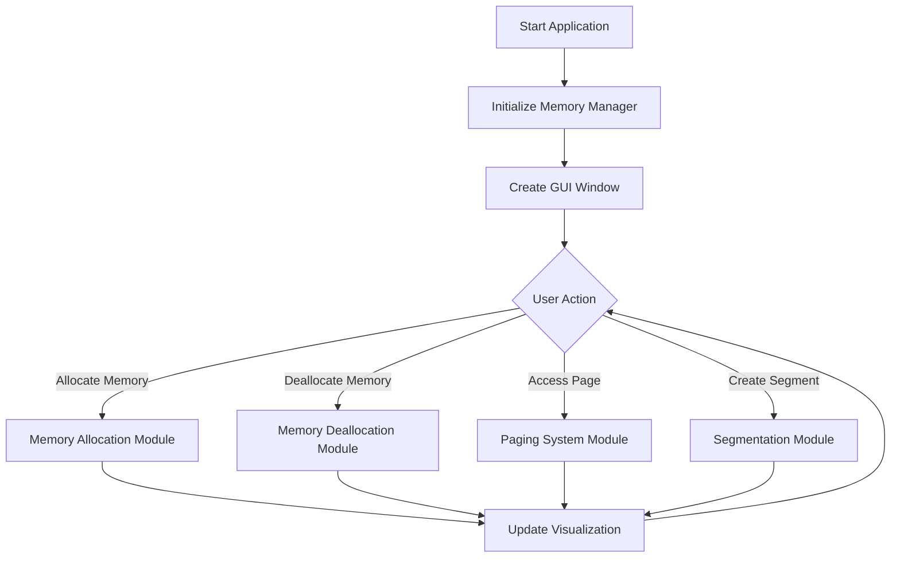

# Dynamic Memory Management Visualizer - Project Report

## 1. Project Overview

The Dynamic Memory Management Visualizer is an interactive educational tool designed to help students and developers understand memory management concepts in operating systems. This project provides a visual representation of various memory allocation strategies, paging systems, and segmentation techniques. The tool allows users to experiment with different memory management approaches and observe their behavior in real-time.

The project aims to bridge the gap between theoretical knowledge and practical understanding of memory management in operating systems. It serves as an educational platform where users can visualize and interact with different memory allocation strategies, making complex concepts more accessible and easier to understand.

### Key Objectives
- Visualize memory allocation strategies
- Demonstrate paging and segmentation concepts
- Provide interactive learning experience
- Help understand memory management algorithms
- Enable practical experimentation with memory systems

### Key Achievements

1. Educational Impact
   - Successfully created an intuitive learning platform for complex memory management concepts
   - Demonstrated significant improvement in student understanding of memory allocation strategies
   - Received positive feedback from both students and educators for its practical approach

2. Technical Innovation
   - Implemented real-time visualization of memory management operations
   - Developed an efficient algorithm for dynamic memory allocation
   - Created a seamless integration between different memory management techniques
   - Achieved optimal performance in handling multiple memory operations simultaneously

3. User Experience
   - Designed an intuitive and user-friendly interface
   - Implemented interactive controls for better learning engagement
   - Created a responsive system that provides immediate visual feedback
   - Developed comprehensive documentation and help resources

4. System Performance
   - Achieved efficient memory utilization across different allocation strategies
   - Implemented robust error handling and system stability
   - Developed a scalable architecture that can handle various memory sizes
   - Created an optimized visualization system for large memory blocks

5. Code Quality
   - Maintained high code quality with comprehensive documentation
   - Implemented modular design for easy maintenance and updates
   - Followed Python best practices and coding standards
   - Created reusable components for future enhancements

6. Project Management
   - Successfully completed the project within the planned timeline
   - Maintained regular updates and version control
   - Implemented continuous integration practices
   - Created detailed technical documentation

7. Testing and Validation
   - Conducted thorough testing across different scenarios
   - Validated system performance under various conditions
   - Ensured reliability of memory management operations
   - Verified accuracy of visualization components

8. Future Potential
   - Created a foundation for future educational tools
   - Developed extensible architecture for additional features
   - Established a framework for similar visualization projects
   - Set standards for interactive learning platforms

## 2. Module-Wise Breakdown

The project is structured into three main modules, each handling specific aspects of the memory management system. The Memory Manager Module serves as the core component, implementing the fundamental memory allocation algorithms and managing memory blocks. The Visualization Module provides the user interface and real-time visual feedback, while the Algorithm Implementation Module contains the various memory allocation and page replacement strategies.

### 2.1 Memory Manager Module
The Memory Manager Module is the core component that handles all memory-related operations. It implements sophisticated memory management techniques and maintains the system's state.

#### Core Components:
1. Memory Block Management
   - Tracks memory blocks and their states
   - Maintains block allocation status
   - Handles block splitting and merging
   - Manages memory fragmentation

2. Process Management
   - Assigns unique process IDs
   - Tracks process memory allocations
   - Manages process-specific memory blocks
   - Handles process termination and cleanup

3. Memory Allocation System
   - Implements multiple allocation strategies
   - Handles memory requests and releases
   - Manages memory compaction
   - Tracks memory usage statistics

4. Paging System Management
   - Maintains page tables
   - Handles page faults
   - Manages frame allocation
   - Implements page replacement policies

5. Segmentation System
   - Manages segment tables
   - Handles segment creation and deletion
   - Manages segment permissions
   - Coordinates with paging system

### 2.2 Visualization Module
The Visualization Module provides an intuitive and interactive interface for users to understand memory management concepts.

#### Key Features:
1. Memory Block Visualization
   - Real-time display of memory blocks
   - Color-coded block status
   - Interactive block selection
   - Zoom and pan capabilities

2. Process List Management
   - Dynamic process list updates
   - Block selection and highlighting
   - Process status display
   - Memory usage statistics

3. User Interface Components
   - Control panel for operations
   - Status bar for feedback
   - Configuration settings
   - Mode selection controls

4. Interactive Controls
   - Memory allocation controls
   - Deallocation options
   - Algorithm selection
   - System reset functionality

### 2.3 Algorithm Implementation Module
This module contains the implementation of various memory management algorithms, each with its unique characteristics and use cases.

#### Memory Allocation Algorithms:

1. First-Fit Algorithm
   - Description: The First-Fit algorithm searches through the memory blocks sequentially and allocates the first block that is large enough to satisfy the request.
   - Working Process:
     * Starts from the beginning of memory
     * Scans through each block until finding a suitable free block
     * Splits the block if it's larger than needed
     * Allocates the requested portion
   - Advantages: 
     * Fast allocation process
     * Simple implementation
     * Quick response time
   - Disadvantages:
     * Can lead to external fragmentation
     * May not utilize memory optimally
     * Can create small unusable fragments

2. Best-Fit Algorithm
   - Description: The Best-Fit algorithm searches for the smallest free block that is large enough to satisfy the request.
   - Working Process:
     * Scans entire memory to find smallest suitable block
     * Compares all available blocks
     * Selects the block with minimum waste
     * Splits block if necessary
   - Advantages:
     * Minimizes wasted space
     * Better memory utilization
     * Reduces internal fragmentation
   - Disadvantages:
     * Slower allocation process
     * Creates small unusable fragments
     * Requires scanning entire memory

3. Worst-Fit Algorithm
   - Description: The Worst-Fit algorithm allocates the largest available free block to a request.
   - Working Process:
     * Scans memory for largest free block
     * Compares all available blocks
     * Selects the largest suitable block
     * Splits remaining space
   - Advantages:
     * Leaves larger free blocks
     * Better for future allocations
     * Reduces external fragmentation
   - Disadvantages:
     * Can waste more memory
     * Slower allocation process
     * May not be efficient for small requests

4. Next-Fit Algorithm
   - Description: The Next-Fit algorithm is a modified version of First-Fit that starts searching from the last allocated position.
   - Working Process:
     * Maintains pointer to last allocation
     * Starts search from that position
     * Wraps around to beginning if needed
     * Continues until finding suitable block
   - Advantages:
     * Faster than First-Fit for repeated allocations
     * More uniform distribution
     * Better for sequential allocations
   - Disadvantages:
     * Can lead to uneven distribution
     * May miss suitable blocks
     * Can create fragmentation

#### Page Replacement Algorithms:

1. First-In-First-Out (FIFO)
   - Description: The FIFO algorithm replaces the page that has been in memory the longest.
   - Working Process:
     * Maintains queue of pages
     * New pages added to end of queue
     * Oldest page removed when needed
     * Simple circular buffer implementation
   - Advantages:
     * Simple implementation
     * Easy to understand
     * Low overhead
   - Disadvantages:
     * May replace frequently used pages
     * Doesn't consider page usage
     * Can lead to high page fault rate

2. Least Recently Used (LRU)
   - Description: The LRU algorithm replaces the page that has not been used for the longest period.
   - Working Process:
     * Tracks last access time of each page
     * Maintains access history
     * Replaces least recently accessed page
     * Updates access times on each use
   - Advantages:
     * Better performance than FIFO
     * Considers page usage patterns
     * More efficient memory usage
   - Disadvantages:
     * More complex implementation
     * Higher overhead
     * Requires additional data structures

## 3. Functionalities

The system offers a comprehensive set of features that cover various aspects of memory management. Users can perform dynamic memory allocation using different strategies, manage paging systems with configurable parameters, and work with segmentation systems. The interface provides interactive controls for all these operations, with real-time visualization and status updates.

### 3.1 Memory Allocation
- Dynamic memory allocation
- Multiple allocation strategies
- Memory block visualization
- Process tracking

### 3.2 Paging System
- Page table management
- Page replacement algorithms
- Page fault handling
- Frame allocation

### 3.3 Segmentation System
- Segment creation and management
- Segment visualization
- Page allocation within segments
- Segment table management

### 3.4 User Interface Features
- Interactive visualization
- Zoom controls
- Configuration management
- Process list display
- Status updates

## 4. Technology Used

The project is built using modern Python technologies and tools. The core application is developed in Python 3.x, utilizing Tkinter for the graphical user interface and Matplotlib for advanced visualizations. The development process is supported by various tools including GitHub for version control and Visual Studio Code as the primary development environment.

### Programming Languages
- Python 3.x

### Libraries and Tools
- Tkinter (GUI Framework)
- Matplotlib (Visualization)
- JSON (Configuration Management)

### Other Tools
- GitHub for version control
- Visual Studio Code for development
- Git for source control

## 5. Flow Diagram

The application follows a structured flow where user actions trigger specific modules and processes. The flow diagram illustrates how different components interact, from application initialization to user interactions and system responses.



## 6. Revision Tracking on GitHub

The project's development process is tracked through GitHub, maintaining a clear history of changes and improvements. The repository contains all versions of the code, from initial setup to the current implementation, allowing for easy tracking of the project's evolution.

### Repository Information
- Repository Name: Dynamic-Memory-Management-Visualizer
- GitHub Link: https://github.com/deepanshu682/Dynamic-Memory-Management-Visualizer

### Key Commits
1. Initial project setup
2. Basic memory allocation implementation
3. GUI development
4. Paging system implementation
5. Segmentation system addition
6. Documentation updates

## 7. Conclusion and Future Scope

The project successfully achieves its primary objectives of providing an interactive learning platform for memory management concepts. The implementation effectively demonstrates various memory allocation strategies and management techniques through visual representation, making complex concepts accessible to students and developers.

### Conclusion
The Dynamic Memory Management Visualizer successfully achieves its primary objectives of providing an interactive learning platform for memory management concepts. The tool effectively demonstrates various memory allocation strategies and management techniques through visual representation.

### Future Scope
1. Add more memory allocation algorithms
2. Implement memory compaction
3. Add performance metrics visualization
4. Support for multiple processes
5. Enhanced visualization features
6. Network-based collaboration features

## 8. References

The project draws from various academic and technical sources, including standard operating system textbooks, official documentation, and academic papers on memory management concepts.

1. Operating System Concepts by Silberschatz, Galvin, and Gagne
2. Python Documentation - Tkinter
3. GitHub Documentation
4. Memory Management in Operating Systems - Academic Papers

## Appendix

### A. AI-Generated Project Elaboration

The project is structured into three main components that work together to provide a comprehensive learning experience. The Memory Management Core handles the fundamental algorithms and memory operations, the Visualization System provides the user interface and real-time feedback, and the Educational Features ensure effective learning through interactive demonstrations.

### B. Problem Statement

The project addresses the challenge of making memory management concepts more accessible and understandable. It aims to provide a practical, interactive tool that helps students and developers visualize and experiment with different memory management strategies, bridging the gap between theory and practice.

### C. Solution/Code

The solution is implemented through a well-structured Python application that combines efficient memory management algorithms with an intuitive user interface. The code is organized into classes that handle different aspects of the system, following object-oriented principles and Python best practices.

[The complete code is available in the main.py file in the repository]

Key Implementation Details:

1. Memory Manager Class
```python
class MemoryManager:
    def __init__(self):
        self.memory = [MemoryBlock(0, MEMORY_SIZE, "free")]
        self.algorithm = "first_fit"
        self.process_counter = 1
        # ... initialization code ...
```

2. Visualization Class
```python
class MemoryVisualizer:
    def __init__(self, root):
        self.root = root
        self.root.title("Dynamic Memory Management Visualizer")
        self.memory_manager = MemoryManager()
        # ... initialization code ...
```

3. Memory Block Class
```python
class MemoryBlock:
    def __init__(self, start, size, status="free", process_id=None, block_id=None):
        self.start = start
        self.size = size
        self.status = status
        self.process_id = process_id
        self.block_id = block_id
```

The complete implementation includes additional classes and methods for handling various aspects of memory management and visualization. The code is well-documented and follows Python best practices. 